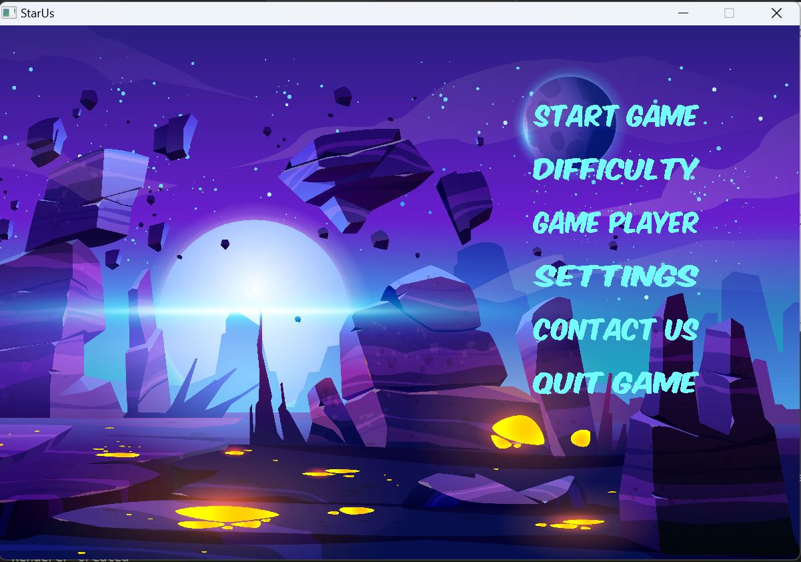
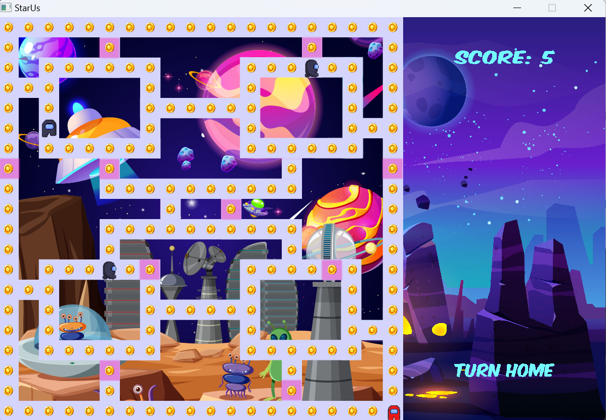

## StarUs Game

### Giới thiệu
Trò chơi được lấy cảm hứng từ game kinh điển Pacman và đồ họa từ Among Us

### Hướng dẫn cài đặt
Tệp thực thi: **`main.exe`**\
Dự án yêu cầu thư viện SDL2: `SDL2`, `SDL2-image`, `SDL2-mixer`, `SDL2-ttf`

Các bước thực hiện: \
**Bước 1:** Tải xuống (hoặc clone)\
**Bước 2:** Mở tệp thực thi

_Nếu tệp thực thi không hoạt động:_
* Cài đặt [MinGW](https://sourceforge.net/projects/mingw-w64/files/?fbclid=IwAR30hhz3qYWvjtJ8y_EqAxYe1xOTSYFKWDtmlO_T5EDLrlumbSDrOrDFMIk) 
* Cài đặt SDL2, SDL2-image, SDL2-mixer, SDL2-ttf ([hướng dẫn](https://phattrienphanmem123az.com/lap-trinh-game-cpp/bai-1-gioi-thieu-cai-dat.html))
* Cài đặt biến

### Hướng dẫn chơi

Bạn có thể làm gì với `MenuGame`?
 * **Thay đổi độ khó (Difficulty):** ***easy,*** ***medium*** và ***hard*** (Bật mí nhỏ: độ khó càng cao thì số địch đuổi bạn càng nhiều đấy) 
 * **Thay đổi nhân vật (Game Player):** có ***8 nhân vật*** tất cả cho bạn lựa chọn
 * **Cài đặt trò chơi (Settings):** Bật tắt âm thanh và thay đổi màn hình
 * **Kết nối với chúng tôi (Contact us):** Nơi bạn gửi những lời phản hồi
 
    

Chơi game như thế nào?

 * **Hãy cẩn thận địch và bom:** bạn sẽ thua ngay khi bị địch bắt và chạm vào bom đang nổ _(Bom sẽ nổ tại vị trí màu hồng bất kì)_
 * **Ăn hết tiền vàng:** để thắng được level này và chuyển lên level khác, hãy thu thập đủ số tiền vàng
 * Nhấn **Start Game** để bắt đầu trải nghiệm nào!

    

### Các kĩ thuật sử dụng

- Thư viện SDL2.0.
- Tìm hiểu lập trình hướng đối tượng.
- Kĩ thuật đọc ghi file.
- Kĩ thuật chia file header và file source.
- Tạo các đối tượng: nhân vật với tính năng như xử lí sự kiện, va chạm, ...
- Tạo các đối tượng phụ: bản đồ, tiền, bom...
- Tạo âm thanh... (có thể bật hoặc tắt bất cứ lúc nào).
- Tạo các menu: Bắt đầu, độ khó, nhân vật, cài đặt, thoát...
- Liên kết với các đường link ngoài.
- Đóng gói chương trình để có thể cài đặt, chơi được ở các máy tính thông thường.

### Trải nghiệm

- Làm quen với lập trình hướng đối tượng.
- Có thêm kĩ năng tìm hiểu thông tin và cập nhật kiến thức mới.
- Có kiến thức về lập trình hướng đối tượng.
- Sáng tạo thuật toán để game có điểm riêng hơn so với các game tương tự.

### Hướng phát triển
- Làm game online đưa lên cho tất cả mọi người cùng chơi và sắp xếp điểm cho mọi người.
- Sử dụng thêm nhiều thuật toán cho nhân vật di chuyển đa dạng hơn.
- Trau chuốt hơn về âm thanh, hình ảnh.
- Code rõ ràng, gọn gàng, đúng cấu trúc hơn.

### Nguồn tham khảo
- https://lazyfoo.net/tutorials/SDL/index.php (các hàm trong thư viện SDL2.0, ...)

- https://phattrienphanmem123az.com/lap-trinh-game-c-p2 (kĩ thuật lập trình hướng đối tượng,...).
- https://wiki.libsdl.org/SDL2/Tutorials

### Lời cảm ơn
Chân thành cảm ơn sự đồng hành của [Mỹ Hạnh](https://www.facebook.com/profile.php?id=100024650258522) - người đã cùng tôi tạo ra đồ họa tốt hơn - Chúc bạn trở thành một designer chuyên nghiệp :>

